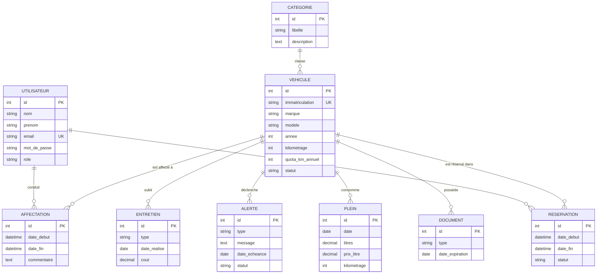

# Jalon 3 — Modélisation de la Base de Données (MERISE)

**Projet fil rouge — CDA (Concepteur Développeur d'Applications)**
**Application : OptiFleet — Gestion de flotte de véhicules**
**Chapitre VI. Modélisation de la base de données**

---

## Sommaire

1. [Introduction à la méthode MERISE](#1-introduction-à-la-méthode-merise)
2. [Dictionnaire des données](#2-dictionnaire-des-données)
3. [Modèle Conceptuel de Données (MCD)](#3-modèle-conceptuel-de-données-mcd)
4. [Modèle Logique de Données (MLD)](#4-modèle-logique-de-données-mld)
5. [Modèle Physique de Données (MPD)](#5-modèle-physique-de-données-mpd)
6. [Justifications et vérification](#6-justifications-et-vérification)

---

## 1. Introduction à la méthode MERISE

Conformément à MERISE, la modélisation est menée en trois étapes successives : **Modèle Conceptuel de Données (MCD)**, **Modèle Logique de Données (MLD)** puis **Modèle Physique de Données (MPD)**. Cette progression du conceptuel vers le physique garantit que la base répond aux besoins fonctionnels tout en étant optimisée pour le SGBD retenu (**PostgreSQL 16**). Le schéma est implémenté via l'ORM **Doctrine** (entités `src/Entity` + migrations versionnées `backend/migrations`).

---

## 2. Dictionnaire des données

| Donnée | Entité | Type logique | Description | Contraintes |
|--------|--------|--------------|-------------|-------------|
| id | (toutes) | Entier | Identifiant technique auto-incrémenté | PK, NOT NULL |
| nom / prenom | Utilisateur | Chaîne (100) | Identité du conducteur/gestionnaire | NOT NULL |
| email | Utilisateur | Chaîne (255) | Identifiant de connexion | NOT NULL, **UNIQUE**, format e-mail |
| mot_de_passe | Utilisateur | Chaîne (255) | Hash bcrypt (jamais en clair) | NOT NULL |
| role | Utilisateur | Chaîne (50) | ADMIN / GESTIONNAIRE / CONDUCTEUR | NOT NULL, défaut `CONDUCTEUR` |
| immatriculation | Vehicule | Chaîne (20) | Plaque au format AA-000-AA | NOT NULL, **UNIQUE** |
| marque / modele | Vehicule | Chaîne (100) | Caractéristiques du véhicule | NOT NULL |
| annee | Vehicule | Entier court | Année de mise en circulation | NOT NULL, 1900–2030 |
| kilometrage | Vehicule | Entier | Kilométrage courant | NOT NULL, ≥ 0 |
| quota_km_annuel | Vehicule | Entier | Quota kilométrique annuel autorisé | ≥ 0 |
| statut | Vehicule | Chaîne (20) | disponible / en_mission / maintenance / inactif | NOT NULL |
| latitude / longitude | Vehicule | Décimal | Géolocalisation (API Google Maps) | NULL autorisé |
| adresse | Vehicule | Texte | Adresse géocodée | NULL autorisé |
| date_debut / date_fin | Affectation | Horodatage | Période d'affectation conducteur↔véhicule | date_fin NULL = active |
| commentaire | Affectation | Texte | Note libre | NULL autorisé |
| type | Entretien | Chaîne (20) | Nature de l'entretien | NOT NULL |
| date_realise | Entretien | Date | Date de réalisation | NOT NULL |
| date_prochaine / km_prochaine | Entretien | Date / Entier | Prochaine échéance | NULL autorisé |
| cout | Entretien | Décimal (10,2) | Coût de l'entretien | ≥ 0 |
| type / message | Alerte | Chaîne / Texte | Type et libellé de l'alerte | NOT NULL |
| date_echeance | Alerte | Date | Échéance de l'alerte | NOT NULL |
| statut | Alerte | Chaîne (20) | en_attente / traitee… | NOT NULL |
| date / litres / prix_litre | Plein | Date / Décimal | Relevé de plein de carburant | NOT NULL, > 0 |
| kilometrage | Plein | Entier | Km au moment du plein | NOT NULL, ≥ 0 |
| type_carburant | Plein | Chaîne (20) | essence / diesel / gpl / electrique | NOT NULL |
| date_debut / date_fin | Reservation | Horodatage | Créneau de réservation | date_fin > date_debut |
| statut | Reservation | Chaîne (20) | en_attente / confirmee / annulee / terminee | NOT NULL |
| motif | Reservation | Texte | Motif de la réservation | NULL autorisé |
| type | Document | Chaîne (30) | assurance / carte_grise / controle_technique… | NOT NULL |
| numero | Document | Chaîne (100) | Référence du document | NULL autorisé |
| date_delivrance / date_expiration | Document | Date | Validité du document | date_expiration NOT NULL |
| libelle / description | Categorie | Chaîne / Texte | Catégorie de véhicule (Berline, SUV…) | libelle NOT NULL |

---

## 3. Modèle Conceptuel de Données (MCD)

**Note sur `Affectation`** : c'est une **classe d'association** entre `Utilisateur` (conducteur) et `Vehicule`, porteuse d'attributs propres (`date_debut`, `date_fin`, `commentaire`). Elle matérialise « qui conduit quel véhicule et depuis quand » ; une affectation est *active* si `date_fin` est nulle ou future.

---

## 4. Modèle Logique de Données (MLD)

Traduction relationnelle du MCD (PK soulignées, FK préfixées) :

- **UTILISATEUR** (<u>id</u>, nom, prenom, email, mot_de_passe, role, created_at) — `email` UNIQUE
- **CATEGORIE** (<u>id</u>, libelle, description)
- **VEHICULE** (<u>id</u>, #categorie_id, immatriculation, marque, modele, annee, kilometrage, quota_km_annuel, statut, latitude, longitude, adresse, created_at, updated_at) — `immatriculation` UNIQUE
- **AFFECTATION** (<u>id</u>, #conducteur_id, #vehicule_id, date_debut, date_fin, commentaire, created_at)
- **ENTRETIEN** (<u>id</u>, #vehicule_id, type, date_realise, date_prochaine, km_prochaine, cout, notes, created_at)
- **ALERTE** (<u>id</u>, #vehicule_id, type, message, date_echeance, statut, created_at)
- **PLEIN** (<u>id</u>, #vehicule_id, date, litres, prix_litre, kilometrage, type_carburant, notes, created_at)
- **RESERVATION** (<u>id</u>, #vehicule_id, #conducteur_id, date_debut, date_fin, statut, motif, created_at)
- **DOCUMENT** (<u>id</u>, #vehicule_id, type, numero, date_delivrance, date_expiration, notes, created_at)

**Clés étrangères** : `vehicule.categorie_id → categorie.id` (SET NULL) ; toutes les tables enfant de `vehicule` (`affectation`, `entretien`, `alerte`, `plein`, `reservation`, `document`) référencent `vehicule.id` en **ON DELETE CASCADE** (composition) ; `affectation.conducteur_id` et `reservation.conducteur_id → utilisateur.id` (CASCADE).

---

## 5. Modèle Physique de Données (MPD)

Extrait du schéma PostgreSQL réel (issu des migrations Doctrine `backend/migrations`) :

| Table | Colonne | Type SQL PostgreSQL | Contrainte |
|-------|---------|---------------------|-----------|
| utilisateur | id | SERIAL | PK |
| utilisateur | email | VARCHAR(255) | UNIQUE, NOT NULL |
| utilisateur | mot_de_passe | VARCHAR(255) | NOT NULL |
| utilisateur | role | VARCHAR(50) | NOT NULL, défaut 'CONDUCTEUR' |
| vehicule | id | SERIAL | PK |
| vehicule | categorie_id | INTEGER | FK → categorie(id) |
| vehicule | immatriculation | VARCHAR(20) | UNIQUE, NOT NULL |
| vehicule | annee | SMALLINT | NOT NULL |
| vehicule | kilometrage | INTEGER | NOT NULL, défaut 0 |
| vehicule | latitude | NUMERIC(10, 8) | NULL |
| vehicule | longitude | NUMERIC(11, 8) | NULL |
| affectation | conducteur_id / vehicule_id | INTEGER | FK, NOT NULL |
| affectation | date_debut / date_fin | TIMESTAMP(0) | date_fin NULL = active |
| entretien | cout | NUMERIC(10, 2) | ≥ 0 |
| alerte | message | TEXT | NOT NULL |
| plein | litres | NUMERIC(8, 2) | NOT NULL |
| plein | prix_litre | NUMERIC(6, 3) | NOT NULL |
| plein | type_carburant | VARCHAR(20) | NOT NULL |
| reservation | date_debut / date_fin | TIMESTAMP(0) | NOT NULL |
| reservation | statut | VARCHAR(20) | NOT NULL |
| document | type | VARCHAR(30) | NOT NULL |
| document | date_expiration | DATE | NOT NULL |

**Index** : clés primaires (`SERIAL`), index sur chaque clé étrangère (`idx_plein_vehicule`, `idx_reservation_vehicule`, `idx_reservation_conducteur`, `idx_document_vehicule`…), contraintes d'unicité sur `utilisateur.email` et `vehicule.immatriculation`.

---

## 6. Justifications et vérification

- **Normalisation (3NF)** : chaque attribut dépend uniquement de la clé primaire de sa table. Les catégories de véhicules sont externalisées dans une table `categorie` dédiée pour éviter la redondance (un libellé « Berline » n'est stocké qu'une fois).
- **Historisation** : la table `affectation` (classe d'association) permet à un véhicule de passer par plusieurs conducteurs dans le temps, et à un conducteur d'avoir un historique d'affectations — sans perte d'information (`date_fin` clôture une affectation plutôt que de la supprimer).
- **Intégrité référentielle** : les entités « faibles » (`entretien`, `alerte`, `plein`, `document`) sont en **composition** avec `vehicule` (suppression en cascade), traduisant qu'elles n'existent pas sans leur véhicule.
- **Réservations sans conflit** : la table `reservation` porte un créneau `date_debut`/`date_fin` ; la détection de chevauchement est assurée applicativement par le validateur `CreneauDisponibleValidator` (contrainte métier `CreneauDisponible`).
- **Sécurité des données** : le mot de passe est stocké **haché** (bcrypt, jamais en clair), conformément au RGPD et aux exigences OWASP.

*Document de conception — Jalon 3 — OptiFleet.*
